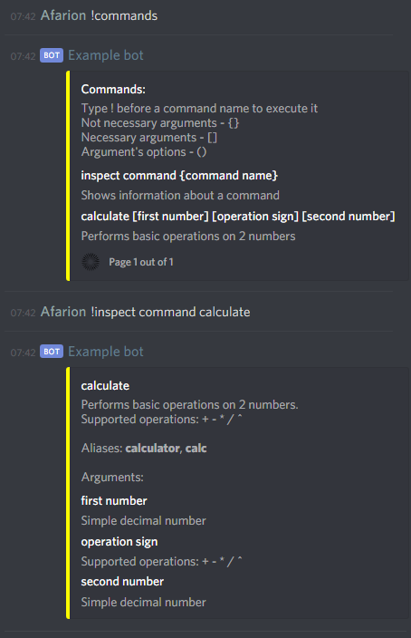
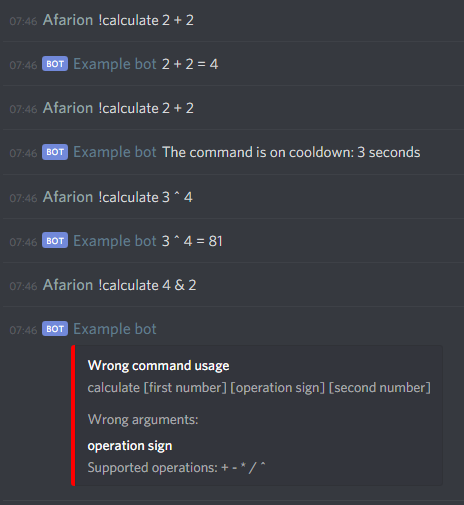

# Command Handler for JDA 
***The handler is in BETA state. It might contain bugs and it's API might change.*** <br/>
The handler provides functionality to quickly set up commands for a Discord bot.

## Example command
To use the handler a JDA object is reqiured. You can find out more [here](https://github.com/DV8FromTheWorld/JDA).
### Implementing command class
**Firstly, boilerplate**:
```java
@Command
public final class CmdCalculator extends AbstractCommand {

    public CmdCalculator(CommandHandler handler) { super(handler) } 

    @Override
    public void execute(MessageReceivedEvent event, CommandArguments args) {
    }
}
```
The class should extend AbstractCommand, be annotated with @Command, have a constructor taking a single argument of CommandHandler type and implement abstract execute method.<br/>
<br/>
**Secondly, command configuration:**
```java
private static final int ID_FIRST_NUMBER = 0;
private static final int ID_OPERATION_SIGN = 1;
private static final int ID_SECOND_NUMBER = 2;

@Config
private static CommandConfig config = new CommandConfigBuilder("calculate")
        .addAliases("calculator", "calc")
        .setDescription("Performs basic operations on 2 numbers")
        .setVerboseDescription("Performs basic operations on 2 numbers.\nSupported operations: + - * / ^")
        .setCooldown(Duration.ofSeconds(5))
        .addArguments(new CommandArgumentConfigBuilder(ID_FIRST_NUMBER, "first number")
                        .setArgumentDescription("Simple decimal number")
                        .setParseToDouble(true),
                    new CommandArgumentConfigBuilder(ID_OPERATION_SIGN, "operation sign")
                        .setArgumentDescription("Supported operations: + - * / ^")
                        .addStringValidators(s -> s.matches("[+|\\-|*|/|^]")),
                    new CommandArgumentConfigBuilder(ID_SECOND_NUMBER, "second number")
                        .setArgumentDescription("Simple decimal number")
                        .setParseToDouble(true))
        .build();
```
Note that the field should be annotated with @Config. A method returning a config could be used instead of a field.<br/>
More features could be found in CommandConfigBuilder and CommandArgumentConfigBuilder javadocs.<br/>
<br/>
**Lastly, implement business logic and message sending:**
```java
@Override
public void execute(MessageReceivedEvent event, CommandArguments args) {
    double firstNumber = args.getDoubleArgumentValue(ID_FIRST_NUMBER);
    double secondNumber = args.getDoubleArgumentValue(ID_SECOND_NUMBER);
    String operation = args.getStringArgumentValue(ID_OPERATION_SIGN);
    double result;

    switch (operation){
        case "+":
            result = firstNumber + secondNumber;
            break;
        case "-":
            result = firstNumber - secondNumber;
            break;
        case "*":
            result = firstNumber * secondNumber;
            break;
        case "/":
            result = firstNumber / secondNumber;
            break;
        case "^":
            result = Math.pow(firstNumber,secondNumber);
            break;
        default:
            event.getChannel().sendMessage("Something went wrong while executing the" +
                    " command, seems like regex is wrong").queue();
            return;
    }

    event.getChannel().sendMessage(suppressZeroes(firstNumber) + " " + operation + " " +
            suppressZeroes(secondNumber) + " = " + suppressZeroes(result)).queue();
}

private String suppressZeroes(double result) {
    return result % 1 == 0 ? Integer.toString((int)result) : Double.toString(result);
}
```

### Creating CommandHandler object and start listening for messages
```java
CommandHandler handler = new CommandHandlerBuilder()
        .setCommandPrefix("!")
        .setJda(jda)
        .build();
handler.start();
````
More about command registering could be found in CommandHandler, Command and Config javadocs.

### Example output:
Embedded commands:<br/>
<br/><br/>
Command execution:<br/> 
<br/>
